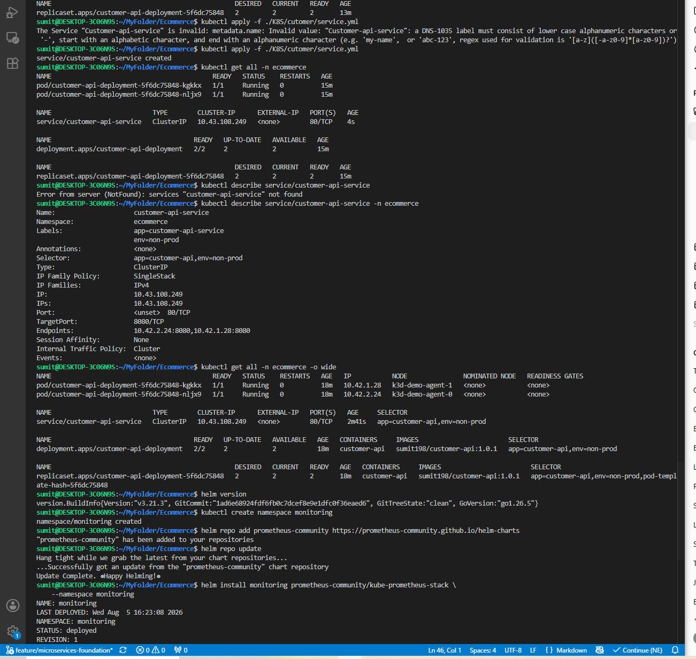
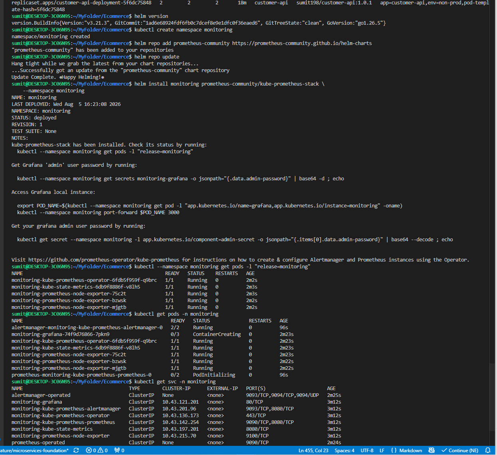
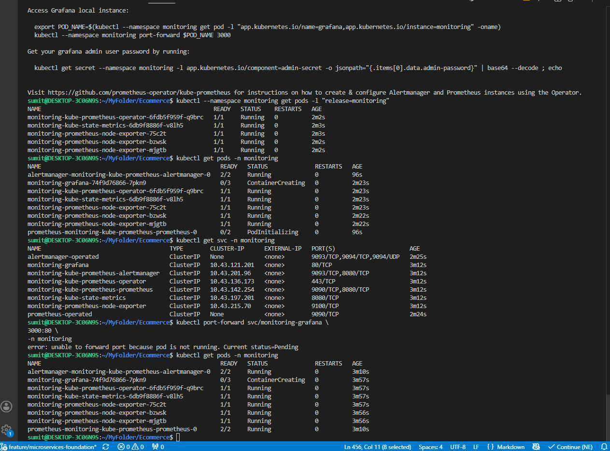

Install Prometheus and Grafana

Install the **kube-prometheus-stack** Helm chart. It includes:

* ✅ Prometheus
* ✅ Grafana
* ✅ Alertmanager
* ✅ Node Exporter
* ✅ kube-state-metrics

Here is everything needed for Kubernetes monitoring in one installation.

---

# Phase 1 – Install Helm

First, verify whether Helm is installed.

```bash
helm version
```

If it isn't installed:

Ubuntu/WSL:

```bash
curl https://raw.githubusercontent.com/helm/helm/main/scripts/get-helm-3 | bash
```

Verify:

```bash
helm version
```

---

# Phase 2 – Create a Monitoring Namespace

Keep monitoring separate from your application.

```bash
kubectl create namespace monitoring
```

Now your cluster looks like:

```text
Cluster

├── kube-system
├── default
├── ecommerce
└── monitoring
```

This separation is a common practice.

---

# Phase 3 – Add the Prometheus Community Repository

```bash
helm repo add prometheus-community https://prometheus-community.github.io/helm-charts
```

Update it:

```bash
helm repo update
```

---

# Phase 4 – Install kube-prometheus-stack

Run:

```bash
helm install monitoring prometheus-community/kube-prometheus-stack \
    --namespace monitoring
```

Now wait about one or two minutes.

Check:

```bash
kubectl get pods -n monitoring
```

Eventually you'll see Pods similar to:

```text
grafana

prometheus

alertmanager

kube-state-metrics

node-exporter

operator
```

Don't worry about every component yet. We'll learn each one gradually.

---

# Phase 5 – Verify Everything

Run

```bash
kubectl get all -n monitoring
```

You should see:

* Deployments
* StatefulSets
* Services
* Pods

This is your first observability stack.

---

# Phase 6 – Open Grafana

Find the service.

```bash
kubectl get svc -n monitoring
```

You'll probably see something like

```text
monitoring-grafana
```

Port-forward it.

```bash
kubectl port-forward svc/monitoring-grafana \
3000:80 \
-n monitoring
```

Now open

```text
http://localhost:3000
```

---

# Phase 7 – Login

Get the password.

```bash
kubectl get secret \
monitoring-grafana \
-n monitoring \
-o jsonpath="{.data.admin-password}" | base64 -d
```

Username

```text
admin
```

Password

(the command above prints it)

Login.

---

# Phase 8 – Open Prometheus

Port-forward

```bash
kubectl port-forward \
svc/monitoring-kube-prometheus-prometheus \
9090:9090 \
-n monitoring
```

Open

```text
http://localhost:9090
```

Now you can execute PromQL queries.

---

# What should you look at first?

Don't click randomly.

Go in this order.

---

## Dashboard 1

Nodes

Observe

* CPU
* Memory
* Network

Questions:

* Which worker node has more CPU usage?
* Which node has Customer API Pods?

---

## Dashboard 2

Pods

Observe

* Pod CPU
* Pod Memory
* Restart Count

Delete a Pod.

Watch the graphs.

---

## Dashboard 3

Deployments

Observe

* Replica Count
* Available Replicas
* Desired Replicas

Scale Customer API.

Watch changes.

---

## Dashboard 4

Namespace

Select

```text
ecommerce
```

Observe only your application.

Ignore kube-system initially.

---

# Now deploy Inventory API

Before deployment

Remember

```text
Pods

CPU

Memory
```

Deploy Inventory.

Refresh Grafana.

Immediately you'll notice

```text
Pods

2

↓

4
```

Deployment

```text
1

↓

2
```

CPU

Slight increase.

Memory

Slight increase.

This is exactly the kind of cause-and-effect learning you're aiming for.

---

# After all APIs are running

Generate traffic.

For example

```text
Browser

↓

React

↓

Customer

↓

Inventory

↓

Database
```

Watch

* CPU
* Memory
* Network
* Requests

Even without application metrics, Kubernetes metrics will already tell you a lot.

---

# Then we'll add application metrics

Right now Grafana knows about:

* Nodes
* Pods
* Containers
* Deployments

It does **not** know things like:

```text
GET /customers

POST /orders

Average Response Time

HTTP 500 Errors
```

Later, we'll add **OpenTelemetry** (or Prometheus instrumentation) to your .NET APIs so those application metrics also appear in Grafana.

---

# Your learning roadmap from this point

```text
Step 1 ✅ Customer API

↓

Step 2 Install Prometheus

↓

Step 3 Install Grafana

↓

Step 4 Learn dashboards

↓

Step 5 Deploy Inventory API

↓

Step 6 Observe changes

↓

Step 7 Deploy Product API

↓

Step 8 Observe changes

↓

Step 9 Connect APIs together

↓

Step 10 Observe network traffic

↓

Step 11 Add OpenTelemetry

↓

Step 12 Add Loki

↓

Step 13 Add Tempo/Jaeger
```

## One important recommendation

We recommend **not using `kubectl port-forward` permanently**. It's great for learning, but since you're already planning to use Ingress later, once you install your Ingress controller, expose **Grafana** through an Ingress as well (for example, `grafana.local` or `grafana.ecommerce.local`). This lets you learn Ingress while also accessing Grafana the same way you would in a production Kubernetes environment.

As we go through this setup, I can also explain **every Pod** that the `kube-prometheus-stack` installs, why it exists, and how they communicate with each other instead of treating it as a black box. That understanding is very useful for DevOps and Platform Engineering interviews.






sumit@DESKTOP-3C06N9S:~/MyFolder$ k3d version
k3d version v5.9.0
k3s version v1.35.5-k3s1 (default)
sumit@DESKTOP-3C06N9S:~/MyFolder$ kubectl get nodes
NAME                STATUS   ROLES           AGE   VERSION
k3d-demo-agent-0    Ready    <none>          46h   v1.35.5+k3s1
k3d-demo-agent-1    Ready    <none>          46h   v1.35.5+k3s1
k3d-demo-server-0   Ready    control-plane   46h   v1.35.5+k3s1
sumit@DESKTOP-3C06N9S:~/MyFolder$ kuber get cluster
kuber: command not found
sumit@DESKTOP-3C06N9S:~/MyFolder$ kuber cluster-info
kuber: command not found
sumit@DESKTOP-3C06N9S:~/MyFolder$ kubectl cluster-info
Kubernetes control plane is running at https://0.0.0.0:33961
CoreDNS is running at https://0.0.0.0:33961/api/v1/namespaces/kube-system/services/kube-dns:dns/proxy
Metrics-server is running at https://0.0.0.0:33961/api/v1/namespaces/kube-system/services/https:metrics-server:https/proxy

To further debug and diagnose cluster problems, use 'kubectl cluster-info dump'.
sumit@DESKTOP-3C06N9S:~/MyFolder$ kubectl cluster list
error: unknown command "cluster" for "kubectl"

Did you mean this?
        cluster-info
sumit@DESKTOP-3C06N9S:~/MyFolder$ kubectl get all -o wide
NAME                                 READY   STATUS    RESTARTS      AGE   IP           NODE               NOMINATED NODE   READINESS GATES
pod/mydemok8s-api-6955bbc585-w4m2j   1/1     Running   3 (30m ago)   46h   10.42.1.26   k3d-demo-agent-1   <none>           <none>
pod/mydemok8s-api-6955bbc585-wkql8   1/1     Running   1 (30m ago)   33h   10.42.2.22   k3d-demo-agent-0   <none>           <none>

NAME                        TYPE       CLUSTER-IP    EXTERNAL-IP   PORT(S)        AGE   SELECTOR
service/mydemok8s-service   NodePort   10.43.74.54   <none>        80:31835/TCP   34h   app=mydemok8s-api

NAME                            READY   UP-TO-DATE   AVAILABLE   AGE   CONTAINERS      IMAGES                           SELECTOR
deployment.apps/mydemok8s-api   2/2     2            2           46h   mydemok8s-api   sumit198/mydemok8sproject:main   app=mydemok8s-api

NAME                                       DESIRED   CURRENT   READY   AGE   CONTAINERS      IMAGES                           SELECTOR
replicaset.apps/mydemok8s-api-6955bbc585   2         2         2       46h   mydemok8s-api   sumit198/mydemok8sproject:main   app=mydemok8s-api,pod-template-hash=6955bbc585
sumit@DESKTOP-3C06N9S:~/MyFolder$ kubectl get ns
NAME              STATUS   AGE
default           Active   46h
kube-node-lease   Active   46h
kube-public       Active   46h
kube-system       Active   46h
mydemok8s         Active   46h
sumit@DESKTOP-3C06N9S:~/MyFolder$ git clone https://github.com/devops-lab-sumit/Ecommerce.git
Cloning into 'Ecommerce'...
remote: Enumerating objects: 1201, done.
remote: Counting objects: 100% (1201/1201), done.
remote: Compressing objects: 100% (471/471), done.
remote: Total 1201 (delta 595), reused 1097 (delta 492), pack-reused 0 (from 0)
Receiving objects: 100% (1201/1201), 1.36 MiB | 3.21 MiB/s, done.
Resolving deltas: 100% (595/595), done.
sumit@DESKTOP-3C06N9S:~/MyFolder$ git branch -a
fatal: not a git repository (or any of the parent directories): .git
sumit@DESKTOP-3C06N9S:~/MyFolder$ cd Ecommerce/
sumit@DESKTOP-3C06N9S:~/MyFolder/Ecommerce$ git branch -a
* main
  remotes/origin/HEAD -> origin/main
  remotes/origin/feature/microservices-foundation
  remotes/origin/main
sumit@DESKTOP-3C06N9S:~/MyFolder/Ecommerce$ git switch -b feature/microservices-foundation origin/feature/microservices-foundation
error: unknown switch `b'
usage: git switch [<options>] [<branch>]

    -c, --[no-]create <branch>
                          create and switch to a new branch
    -C, --[no-]force-create <branch>
                          create/reset and switch to a branch
    --[no-]guess          second guess 'git switch <no-such-branch>'
    --[no-]discard-changes
                          throw away local modifications
    -q, --[no-]quiet      suppress progress reporting
    --[no-]recurse-submodules[=<checkout>]
                          control recursive updating of submodules
    --[no-]progress       force progress reporting
    -m, --[no-]merge      perform a 3-way merge with the new branch
    --[no-]conflict <style>
                          conflict style (merge, diff3, or zdiff3)
    -d, --[no-]detach     detach HEAD at named commit
    -t, --[no-]track[=(direct|inherit)]
                          set branch tracking configuration
    -f, --[no-]force      force checkout (throw away local modifications)
    --[no-]orphan <new-branch>
                          new unborn branch
    --[no-]overwrite-ignore
                          update ignored files (default)
    --[no-]ignore-other-worktrees
                          do not check if another worktree is using this branch

sumit@DESKTOP-3C06N9S:~/MyFolder/Ecommerce$ git switch -c feature/microservices-foundation origin/feature/microservices-foundation
branch 'feature/microservices-foundation' set up to track 'origin/feature/microservices-foundation'.
Switched to a new branch 'feature/microservices-foundation'
sumit@DESKTOP-3C06N9S:~/MyFolder/Ecommerce$ kubectl apply -f ./K8S/namespace/ecommerce.yml
namespace/ecommerce created
sumit@DESKTOP-3C06N9S:~/MyFolder/Ecommerce$ kubectl get namespace
NAME              STATUS   AGE
default           Active   47h
ecommerce         Active   11s
kube-node-lease   Active   47h
kube-public       Active   47h
kube-system       Active   47h
mydemok8s         Active   47h
sumit@DESKTOP-3C06N9S:~/MyFolder/Ecommerce$   kubectl create secret docker-registry regcred \
  --namespace=ecommerce \
  --docker-server=https://index.docker.io/v1/ \
  --docker-username=sumit198 \
  --docker-password=PAT token or password\
  --docker-email=sumit20558@gmail.com
secret/regcred created
sumit@DESKTOP-3C06N9S:~/MyFolder/Ecommerce$ ls
 'Design Document'   Ecommerce.sln   K8S   frontend   run-all.ps1   src
sumit@DESKTOP-3C06N9S:~/MyFolder/Ecommerce$ kubect get secret
Command 'kubect' not found, did you mean:
  command 'kubectx' from deb kubectx (0.9.5-2build1)
Try: sudo apt install <deb name>
sumit@DESKTOP-3C06N9S:~/MyFolder/Ecommerce$ kubectl get secret
No resources found in mydemok8s namespace.
sumit@DESKTOP-3C06N9S:~/MyFolder/Ecommerce$ kubectl get secret -n ecommerce
NAME      TYPE                             DATA   AGE
regcred   kubernetes.io/dockerconfigjson   1      52s
sumit@DESKTOP-3C06N9S:~/MyFolder/Ecommerce$ kubectl apply -f ./K8S/cutomer/deployment.yml
Error from server (BadRequest): error when creating "./K8S/cutomer/deployment.yml": Deployment in version "v1" cannot be handled as a Deployment: strict decoding error: unknown field "spec.Selector", unknown field "spec.template.spec.containers[0].ports[0].containerport"
sumit@DESKTOP-3C06N9S:~/MyFolder/Ecommerce$ kubectl apply -f ./K8S/cutomer/deployment.yml
The Deployment "Customer-api" is invalid: 
* metadata.name: Invalid value: "Customer-api": a lowercase RFC 1123 subdomain must consist of lower case alphanumeric characters, '-' or '.', and must start and end with an alphanumeric character (e.g. 'example.com', regex used for validation is '[a-z0-9]([-a-z0-9]*[a-z0-9])?(\.[a-z0-9]([-a-z0-9]*[a-z0-9])?)*')
* spec.template.spec.containers[0].name: Invalid value: "Customer-api": a lowercase RFC 1123 label must consist of lower case alphanumeric characters or '-', and must start and end with an alphanumeric character (e.g. 'my-name',  or '123-abc', regex used for validation is '[a-z0-9]([-a-z0-9]*[a-z0-9])?')
sumit@DESKTOP-3C06N9S:~/MyFolder/Ecommerce$ kubectl apply -f ./K8S/cutomer/deployment.yml
deployment.apps/customer-api created
sumit@DESKTOP-3C06N9S:~/MyFolder/Ecommerce$ kubectl get pods
NAME                             READY   STATUS         RESTARTS       AGE
customer-api-5f6dc75848-d4fvz    0/1     ErrImagePull   0              9s
customer-api-5f6dc75848-rqxdb    0/1     ErrImagePull   0              9s
mydemok8s-api-6955bbc585-w4m2j   1/1     Running        3 (109m ago)   47h
mydemok8s-api-6955bbc585-wkql8   1/1     Running        1 (109m ago)   35h
sumit@DESKTOP-3C06N9S:~/MyFolder/Ecommerce$ kubectl get pods -n ecommerce
No resources found in ecommerce namespace.
sumit@DESKTOP-3C06N9S:~/MyFolder/Ecommerce$ kubectl explain deployment
GROUP:      apps
KIND:       Deployment
VERSION:    v1

DESCRIPTION:
    Deployment enables declarative updates for Pods and ReplicaSets.
    
FIELDS:
  apiVersion    <string>
    APIVersion defines the versioned schema of this representation of an object.
    Servers should convert recognized schemas to the latest internal value, and
    may reject unrecognized values. More info:
    https://git.k8s.io/community/contributors/devel/sig-architecture/api-conventions.md#resources

  kind  <string>
    Kind is a string value representing the REST resource this object
    represents. Servers may infer this from the endpoint the client submits
    requests to. Cannot be updated. In CamelCase. More info:
    https://git.k8s.io/community/contributors/devel/sig-architecture/api-conventions.md#types-kinds

  metadata      <ObjectMeta>
    Standard object's metadata. More info:
    https://git.k8s.io/community/contributors/devel/sig-architecture/api-conventions.md#metadata

  spec  <DeploymentSpec>
    Specification of the desired behavior of the Deployment.

  status        <DeploymentStatus>
    Most recently observed status of the Deployment.


sumit@DESKTOP-3C06N9S:~/MyFolder/Ecommerce$ kubectl explain deployment.FIELDS.metadata
GROUP:      apps
KIND:       Deployment
VERSION:    v1

error: field "metadata" does not exist
sumit@DESKTOP-3C06N9S:~/MyFolder/Ecommerce$ kubectl delete deployment customer-api
deployment.apps "customer-api" deleted from mydemok8s namespace
sumit@DESKTOP-3C06N9S:~/MyFolder/Ecommerce$ kubectl get pods 
NAME                             READY   STATUS    RESTARTS       AGE
mydemok8s-api-6955bbc585-w4m2j   1/1     Running   3 (114m ago)   47h
mydemok8s-api-6955bbc585-wkql8   1/1     Running   1 (114m ago)   35h
sumit@DESKTOP-3C06N9S:~/MyFolder/Ecommerce$ kubectl apply -f ./K8S/cutomer/deployment.yml
deployment.apps/customer-api-deployment created
sumit@DESKTOP-3C06N9S:~/MyFolder/Ecommerce$ kubectl get pods 
NAME                             READY   STATUS    RESTARTS       AGE
mydemok8s-api-6955bbc585-w4m2j   1/1     Running   3 (115m ago)   47h
mydemok8s-api-6955bbc585-wkql8   1/1     Running   1 (115m ago)   35h
sumit@DESKTOP-3C06N9S:~/MyFolder/Ecommerce$ kubectl get pods -n ecommerce
NAME                                       READY   STATUS              RESTARTS   AGE
customer-api-deployment-5f6dc75848-kgkkx   0/1     ContainerCreating   0          13s
customer-api-deployment-5f6dc75848-nljx9   0/1     ContainerCreating   0          13s
sumit@DESKTOP-3C06N9S:~/MyFolder/Ecommerce$ kubectl get pods -n ecommerce -w
NAME                                       READY   STATUS              RESTARTS   AGE
customer-api-deployment-5f6dc75848-kgkkx   0/1     ContainerCreating   0          22s
customer-api-deployment-5f6dc75848-nljx9   0/1     ContainerCreating   0          22s
customer-api-deployment-5f6dc75848-kgkkx   1/1     Running             0          67s
customer-api-deployment-5f6dc75848-nljx9   1/1     Running             0          68s
^Csumit@DESKTOP-3C06N9S:~/MyFolder/Ecommerce$ kubectl apply -f ./K8S/cutomer/deployment.yml
deployment.apps/customer-api-deployment created
sumit@DESKTOP-3C06N9S:~/MyFolder/Ecommerce$ kubectl get pods 
NAME                                       READY   STATUS         RESTARTS       AGE
customer-api-deployment-5f6dc75848-sd5gp   0/1     ErrImagePull   0              10s
customer-api-deployment-5f6dc75848-tpknp   0/1     ErrImagePull   0              10s
mydemok8s-api-6955bbc585-w4m2j             1/1     Running        3 (116m ago)   47h
mydemok8s-api-6955bbc585-wkql8             1/1     Running        1 (116m ago)   35h
sumit@DESKTOP-3C06N9S:~/MyFolder/Ecommerce$ kubectl describe customer-api-deployment-5f6dc75848-sd5gp
error: the server doesn't have a resource type "customer-api-deployment-5f6dc75848-sd5gp"
sumit@DESKTOP-3C06N9S:~/MyFolder/Ecommerce$ kubectl describe pod customer-api-deployment-5f6dc75848-sd5gp
Name:             customer-api-deployment-5f6dc75848-sd5gp
Namespace:        mydemok8s
Priority:         0
Service Account:  default
Node:             k3d-demo-agent-0/172.19.0.3
Start Time:       Wed, 05 Aug 2026 15:50:33 +0000
Labels:           app=customer-api
                  env=non-prod
                  pod-template-hash=5f6dc75848
Annotations:      <none>
Status:           Pending
IP:               10.42.2.25
IPs:
  IP:           10.42.2.25
Controlled By:  ReplicaSet/customer-api-deployment-5f6dc75848
Containers:
  customer-api:
    Container ID:   
    Image:          sumit198/customer-api:1.0.1
    Image ID:       
    Port:           80/TCP
    Host Port:      0/TCP
    State:          Waiting
      Reason:       ImagePullBackOff
    Ready:          False
    Restart Count:  0
    Environment:    <none>
    Mounts:
      /var/run/secrets/kubernetes.io/serviceaccount from kube-api-access-4sbf6 (ro)
Conditions:
  Type                        Status
  PodReadyToStartContainers   True 
  Initialized                 True 
  Ready                       False 
  ContainersReady             False 
  PodScheduled                True 
Volumes:
  kube-api-access-4sbf6:
    Type:                    Projected (a volume that contains injected data from multiple sources)
    TokenExpirationSeconds:  3607
    ConfigMapName:           kube-root-ca.crt
    Optional:                false
    DownwardAPI:             true
QoS Class:                   BestEffort
Node-Selectors:              <none>
Tolerations:                 node.kubernetes.io/not-ready:NoExecute op=Exists for 300s
                             node.kubernetes.io/unreachable:NoExecute op=Exists for 300s
Events:
  Type     Reason                           Age                From               Message
  ----     ------                           ----               ----               -------
  Normal   Scheduled                        95s                default-scheduler  Successfully assigned mydemok8s/customer-api-deployment-5f6dc75848-sd5gp to k3d-demo-agent-0
  Normal   BackOff                          15s (x5 over 93s)  kubelet            spec.containers{customer-api}: Back-off pulling image "sumit198/customer-api:1.0.1"
  Warning  Failed                           15s (x5 over 93s)  kubelet            spec.containers{customer-api}: Error: ImagePullBackOff
  Warning  FailedToRetrieveImagePullSecret  4s (x9 over 95s)   kubelet            Unable to retrieve some image pull secrets (regcred); attempting to pull the image may not succeed.
  Normal   Pulling                          4s (x4 over 95s)   kubelet            spec.containers{customer-api}: Pulling image "sumit198/customer-api:1.0.1"
  Warning  Failed                           3s (x4 over 93s)   kubelet            spec.containers{customer-api}: Failed to pull image "sumit198/customer-api:1.0.1": failed to pull and unpack image "docker.io/sumit198/customer-api:1.0.1": failed to resolve reference "docker.io/sumit198/customer-api:1.0.1": pull access denied, repository does not exist or may require authorization: server message: insufficient_scope: authorization failed
  Warning  Failed                           3s (x4 over 93s)   kubelet            spec.containers{customer-api}: Error: ErrImagePull
sumit@DESKTOP-3C06N9S:~/MyFolder/Ecommerce$ kubectl get deployment customer-api-deployment -o yaml
apiVersion: apps/v1
kind: Deployment
metadata:
  annotations:
    deployment.kubernetes.io/revision: "1"
    kubectl.kubernetes.io/last-applied-configuration: |
      {"apiVersion":"apps/v1","kind":"Deployment","metadata":{"annotations":{},"labels":{"app":"customer-api","env":"non-prod"},"name":"customer-api-deployment","namespace":"mydemok8s"},"spec":{"replicas":2,"selector":{"matchLabels":{"app":"customer-api","env":"non-prod"}},"template":{"metadata":{"labels":{"app":"customer-api","env":"non-prod"}},"spec":{"containers":[{"image":"sumit198/customer-api:1.0.1","imagePullPolicy":"Always","name":"customer-api","ports":[{"containerPort":80}]}],"imagePullSecrets":[{"name":"regcred"}]}}}}
  creationTimestamp: "2026-08-05T15:50:33Z"
  generation: 1
  labels:
    app: customer-api
    env: non-prod
  name: customer-api-deployment
  namespace: mydemok8s
  resourceVersion: "35864"
  uid: 470daccc-a8e1-4cd8-988a-6d6d4ac6c4d4
spec:
  progressDeadlineSeconds: 600
  replicas: 2
  revisionHistoryLimit: 10
  selector:
    matchLabels:
      app: customer-api
      env: non-prod
  strategy:
    rollingUpdate:
      maxSurge: 25%
      maxUnavailable: 25%
    type: RollingUpdate
  template:
    metadata:
      labels:
        app: customer-api
        env: non-prod
    spec:
      containers:
      - image: sumit198/customer-api:1.0.1
        imagePullPolicy: Always
        name: customer-api
        ports:
        - containerPort: 80
          protocol: TCP
        resources: {}
        terminationMessagePath: /dev/termination-log
        terminationMessagePolicy: File
      dnsPolicy: ClusterFirst
      imagePullSecrets:
      - name: regcred
      restartPolicy: Always
      schedulerName: default-scheduler
      securityContext: {}
      terminationGracePeriodSeconds: 30
status:
  conditions:
  - lastTransitionTime: "2026-08-05T15:50:33Z"
    lastUpdateTime: "2026-08-05T15:50:33Z"
    message: Deployment does not have minimum availability.
    reason: MinimumReplicasUnavailable
    status: "False"
    type: Available
  - lastTransitionTime: "2026-08-05T15:50:33Z"
    lastUpdateTime: "2026-08-05T15:50:33Z"
    message: ReplicaSet "customer-api-deployment-5f6dc75848" is progressing.
    reason: ReplicaSetUpdated
    status: "True"
    type: Progressing
  observedGeneration: 1
  replicas: 2
  terminatingReplicas: 0
  unavailableReplicas: 2
  updatedReplicas: 2
sumit@DESKTOP-3C06N9S:~/MyFolder/Ecommerce$ kubectl apply -f ./K8S/cutomer/service.yml
Error from server (BadRequest): error when creating "./K8S/cutomer/service.yml": Service in version "v1" cannot be handled as a Service: json: cannot unmarshal object into Go struct field ServiceSpec.spec.ports of type []v1.ServicePort
sumit@DESKTOP-3C06N9S:~/MyFolder/Ecommerce$ kubectl get all -n ecommerce
NAME                                           READY   STATUS    RESTARTS   AGE
pod/customer-api-deployment-5f6dc75848-kgkkx   1/1     Running   0          13m
pod/customer-api-deployment-5f6dc75848-nljx9   1/1     Running   0          13m

NAME                                      READY   UP-TO-DATE   AVAILABLE   AGE
deployment.apps/customer-api-deployment   2/2     2            2           13m

NAME                                                 DESIRED   CURRENT   READY   AGE
replicaset.apps/customer-api-deployment-5f6dc75848   2         2         2       13m
sumit@DESKTOP-3C06N9S:~/MyFolder/Ecommerce$ kubectl apply -f ./K8S/cutomer/service.yml
The Service "Customer-api-service" is invalid: metadata.name: Invalid value: "Customer-api-service": a DNS-1035 label must consist of lower case alphanumeric characters or '-', start with an alphabetic character, and end with an alphanumeric character (e.g. 'my-name',  or 'abc-123', regex used for validation is '[a-z]([-a-z0-9]*[a-z0-9])?')
sumit@DESKTOP-3C06N9S:~/MyFolder/Ecommerce$ kubectl apply -f ./K8S/cutomer/service.yml
service/customer-api-service created
sumit@DESKTOP-3C06N9S:~/MyFolder/Ecommerce$ kubectl get all -n ecommerce
NAME                                           READY   STATUS    RESTARTS   AGE
pod/customer-api-deployment-5f6dc75848-kgkkx   1/1     Running   0          15m
pod/customer-api-deployment-5f6dc75848-nljx9   1/1     Running   0          15m

NAME                           TYPE        CLUSTER-IP      EXTERNAL-IP   PORT(S)   AGE
service/customer-api-service   ClusterIP   10.43.108.249   <none>        80/TCP    4s

NAME                                      READY   UP-TO-DATE   AVAILABLE   AGE
deployment.apps/customer-api-deployment   2/2     2            2           15m

NAME                                                 DESIRED   CURRENT   READY   AGE
replicaset.apps/customer-api-deployment-5f6dc75848   2         2         2       15m
sumit@DESKTOP-3C06N9S:~/MyFolder/Ecommerce$ kubectl describe service/customer-api-service
Error from server (NotFound): services "customer-api-service" not found
sumit@DESKTOP-3C06N9S:~/MyFolder/Ecommerce$ kubectl describe service/customer-api-service -n ecommerce
Name:                     customer-api-service
Namespace:                ecommerce
Labels:                   app=customer-api-service
                          env=non-prod
Annotations:              <none>
Selector:                 app=customer-api,env=non-prod
Type:                     ClusterIP
IP Family Policy:         SingleStack
IP Families:              IPv4
IP:                       10.43.108.249
IPs:                      10.43.108.249
Port:                     <unset>  80/TCP
TargetPort:               8080/TCP
Endpoints:                10.42.2.24:8080,10.42.1.28:8080
Session Affinity:         None
Internal Traffic Policy:  Cluster
Events:                   <none>
sumit@DESKTOP-3C06N9S:~/MyFolder/Ecommerce$ kubectl get all -n ecommerce -o wide
NAME                                           READY   STATUS    RESTARTS   AGE   IP           NODE               NOMINATED NODE   READINESS GATES
pod/customer-api-deployment-5f6dc75848-kgkkx   1/1     Running   0          18m   10.42.1.28   k3d-demo-agent-1   <none>           <none>
pod/customer-api-deployment-5f6dc75848-nljx9   1/1     Running   0          18m   10.42.2.24   k3d-demo-agent-0   <none>           <none>

NAME                           TYPE        CLUSTER-IP      EXTERNAL-IP   PORT(S)   AGE     SELECTOR
service/customer-api-service   ClusterIP   10.43.108.249   <none>        80/TCP    2m41s   app=customer-api,env=non-prod

NAME                                      READY   UP-TO-DATE   AVAILABLE   AGE   CONTAINERS     IMAGES                        SELECTOR
deployment.apps/customer-api-deployment   2/2     2            2           18m   customer-api   sumit198/customer-api:1.0.1   app=customer-api,env=non-prod

NAME                                                 DESIRED   CURRENT   READY   AGE   CONTAINERS     IMAGES                        SELECTOR
replicaset.apps/customer-api-deployment-5f6dc75848   2         2         2       18m   customer-api   sumit198/customer-api:1.0.1   app=customer-api,env=non-prod,pod-template-hash=5f6dc75848
sumit@DESKTOP-3C06N9S:~/MyFolder/Ecommerce$ helm version
version.BuildInfo{Version:"v3.21.3", GitCommit:"1ad6e68924fdf6fb0c7dcef8e9e1dfc0f36eaed6", GitTreeState:"clean", GoVersion:"go1.26.5"}
sumit@DESKTOP-3C06N9S:~/MyFolder/Ecommerce$ kubectl create namespace monitoring
namespace/monitoring created
sumit@DESKTOP-3C06N9S:~/MyFolder/Ecommerce$ helm repo add prometheus-community https://prometheus-community.github.io/helm-charts
"prometheus-community" has been added to your repositories
sumit@DESKTOP-3C06N9S:~/MyFolder/Ecommerce$ helm repo update
Hang tight while we grab the latest from your chart repositories...
...Successfully got an update from the "prometheus-community" chart repository
Update Complete. ⎈Happy Helming!⎈
sumit@DESKTOP-3C06N9S:~/MyFolder/Ecommerce$ helm install monitoring prometheus-community/kube-prometheus-stack \
    --namespace monitoring
NAME: monitoring
LAST DEPLOYED: Wed Aug  5 16:23:08 2026
NAMESPACE: monitoring
STATUS: deployed
REVISION: 1
TEST SUITE: None
NOTES:
kube-prometheus-stack has been installed. Check its status by running:
  kubectl --namespace monitoring get pods -l "release=monitoring"

Get Grafana 'admin' user password by running:

  kubectl --namespace monitoring get secrets monitoring-grafana -o jsonpath="{.data.admin-password}" | base64 -d ; echo

Access Grafana local instance:

  export POD_NAME=$(kubectl --namespace monitoring get pod -l "app.kubernetes.io/name=grafana,app.kubernetes.io/instance=monitoring" -oname)
  kubectl --namespace monitoring port-forward $POD_NAME 3000

Get your grafana admin user password by running:

  kubectl get secret --namespace monitoring -l app.kubernetes.io/component=admin-secret -o jsonpath="{.items[0].data.admin-password}" | base64 --decode ; echo


Visit https://github.com/prometheus-operator/kube-prometheus for instructions on how to create & configure Alertmanager and Prometheus instances using the Operator.
sumit@DESKTOP-3C06N9S:~/MyFolder/Ecommerce$ kubectl --namespace monitoring get pods -l "release=monitoring"
NAME                                                   READY   STATUS    RESTARTS   AGE
monitoring-kube-prometheus-operator-6fdb5f959f-q9brc   1/1     Running   0          2m2s
monitoring-kube-state-metrics-6db9f8886f-v8lh5         1/1     Running   0          2m3s
monitoring-prometheus-node-exporter-75c2t              1/1     Running   0          2m3s
monitoring-prometheus-node-exporter-bzwsk              1/1     Running   0          2m2s
monitoring-prometheus-node-exporter-mjgtb              1/1     Running   0          2m2s
sumit@DESKTOP-3C06N9S:~/MyFolder/Ecommerce$ kubectl get pods -n monitoring
NAME                                                     READY   STATUS              RESTARTS   AGE
alertmanager-monitoring-kube-prometheus-alertmanager-0   2/2     Running             0          96s
monitoring-grafana-74f9d76866-7pkn9                      0/3     ContainerCreating   0          2m23s
monitoring-kube-prometheus-operator-6fdb5f959f-q9brc     1/1     Running             0          2m23s
monitoring-kube-state-metrics-6db9f8886f-v8lh5           1/1     Running             0          2m23s
monitoring-prometheus-node-exporter-75c2t                1/1     Running             0          2m23s
monitoring-prometheus-node-exporter-bzwsk                1/1     Running             0          2m22s
monitoring-prometheus-node-exporter-mjgtb                1/1     Running             0          2m22s
prometheus-monitoring-kube-prometheus-prometheus-0       0/2     PodInitializing     0          96s
sumit@DESKTOP-3C06N9S:~/MyFolder/Ecommerce$ kubectl get svc -n monitoring
NAME                                      TYPE        CLUSTER-IP      EXTERNAL-IP   PORT(S)                      AGE
alertmanager-operated                     ClusterIP   None            <none>        9093/TCP,9094/TCP,9094/UDP   2m25s
monitoring-grafana                        ClusterIP   10.43.121.201   <none>        80/TCP                       3m12s
monitoring-kube-prometheus-alertmanager   ClusterIP   10.43.201.96    <none>        9093/TCP,8080/TCP            3m12s
monitoring-kube-prometheus-operator       ClusterIP   10.43.136.173   <none>        443/TCP                      3m12s
monitoring-kube-prometheus-prometheus     ClusterIP   10.43.142.254   <none>        9090/TCP,8080/TCP            3m12s
monitoring-kube-state-metrics             ClusterIP   10.43.197.201   <none>        8080/TCP                     3m12s
monitoring-prometheus-node-exporter       ClusterIP   10.43.215.70    <none>        9100/TCP                     3m12s
prometheus-operated                       ClusterIP   None            <none>        9090/TCP                     2m24s
sumit@DESKTOP-3C06N9S:~/MyFolder/Ecommerce$ kubectl port-forward svc/monitoring-grafana \
3000:80 \
-n monitoring
error: unable to forward port because pod is not running. Current status=Pending
sumit@DESKTOP-3C06N9S:~/MyFolder/Ecommerce$ kubectl get pods -n monitoring
NAME                                                     READY   STATUS              RESTARTS   AGE
alertmanager-monitoring-kube-prometheus-alertmanager-0   2/2     Running             0          3m10s
monitoring-grafana-74f9d76866-7pkn9                      0/3     ContainerCreating   0          3m57s
monitoring-kube-prometheus-operator-6fdb5f959f-q9brc     1/1     Running             0          3m57s
monitoring-kube-state-metrics-6db9f8886f-v8lh5           1/1     Running             0          3m57s
monitoring-prometheus-node-exporter-75c2t                1/1     Running             0          3m57s
monitoring-prometheus-node-exporter-bzwsk                1/1     Running             0          3m56s
monitoring-prometheus-node-exporter-mjgtb                1/1     Running             0          3m56s
prometheus-monitoring-kube-prometheus-prometheus-0       2/2     Running             0          3m10s
sumit@DESKTOP-3C06N9S:~/MyFolder/Ecommerce$ 

